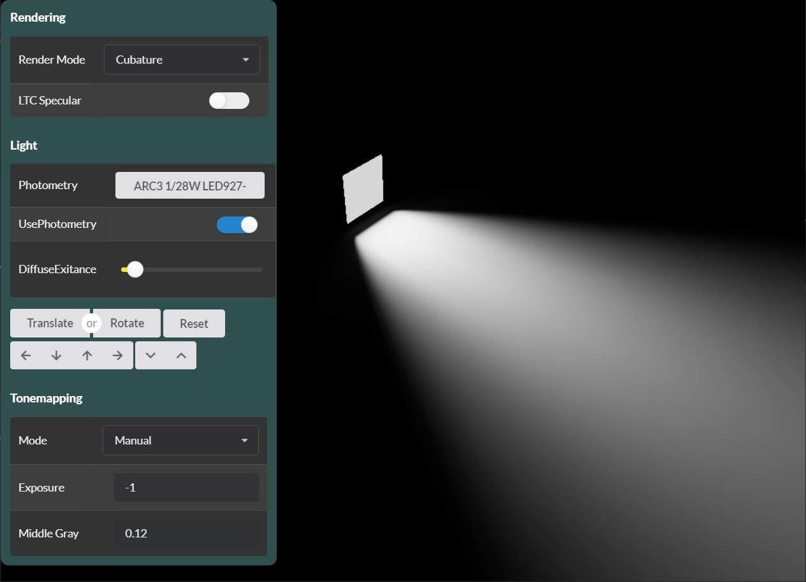

# Real-time Approximation of Photometric Polygonal Lights

This repository contains a demo application as supplemental material to the publication ["Real-time Approximation of Photometric Polygonal Lights"](https://rtappl.vrvis.at/) that is part of the I3D 2020 paper program and published in the PACMCGIT journal.

The demo is implemented in F# and is based on the [Aardvark plattform](https://github.com/aardvark-platform) together with [FShade](https://www.fshade.org/), a DSL for shader programming. The main shading procedure of the cubature technique presentend in the paper can be found in [Cubature.fs](https://github.com/luithefirst/rtappl/blob/master/src/Cubature.fs#L95). If you are interested in the generated GLSL code, you can inspect the files in the shader cache directory: `%APPDATA%\Roaming\Aardvark\OpenGlShaderCache`

## How to build

The demo requires the .NET Core 3.0 SDK. It manages Nuget packages using `paket` (https://fsprojects.github.io/Paket/) that needs to be installed as local dotnet tool using the .NET Core CLI. The packages need to be restored before the build.

`dotnet tool install Paket --tool-path .paket`

`.paket\paket.exe restore`

`dotnet build Demo.sln`

You can also use the supplied build script by executing `build` in the command prompt. The script uses [aardvark.fake](https://github.com/aardvark-platform/aardvark.fake) with extended functionality.

The `Demo.exe` is built to `bin\Release\netcoreapp3.1\` and can be run from this directory.

# Update 14/09/2020

- Changed photometry data textures to cube maps: improved performance in all techniques
- Optimized shader code - performing polygon initialization for cubature in single loop:
1. Calculate Closest Point
2. Polygon Setup
    + tangent-space transformation
    + horizon clipping
    + closest point clamping
    + radiance initialization
3. Cubature based on triangulation

Updated GPU time of the shading pass measured in our benchmark framework on a RTX 2080 TI:

|              | 1080p  | 1440p  | 2160p  |
| ------------ | ------ | ------ | ------ |
| Cubature     | 0.30ms | 0.51ms | 1.16ms |
| Cubature+LTC | 0.62ms | 1.08ms | 2.37ms |
| Point        | 0.08ms | 0.14ms | 0.28ms |
| MC 8         | 0.27ms | 0.47ms | 1.08ms | 
| MC 8 + DN 16 | 0.85ms | 1.52ms | 3.45ms | 
